# Capstone Project: The Battle of Neighborhoods | Business Proposal for Culinary Business in Tangerang Regency

## **1. Introduction/Business Understanding**
As many of the people migrate and looking forward to have better living, many people migrate from rural to urbanized area. As part in exploring better facilities around their neighborhood. It will help people making smart and reasonable decision on selecting best neighborhood out of numbers of other neighborhoods in Tangerang Regency, Banten, Indonesia.

Canada is one of the most destined migration place which have a good salaries with affordable living costs, and good business oppurtunities. As most of people know, Indonesian culinary is one of the top selling business and attraction when traveller visit Indonesia, and Soekarno Hatta international airport is also located in Tangerang Regency, Banten, Indonesia.

This Proposal aim to create an analysis of features for a low-middle income population in Tangerang District to choose the best and flourishing culinary business between neighborhoods. The features include the top selling food types and number of population in nearby districts.

It will help people to get awareness of the area and neighborhood before moving to a new city, state, country or place for their work or to start a new culinary business.

## **2. Problem Identification**

The major purpose of this project, is to suggest a better neighborhood for the person who are migrating/moving there to start a culinary business. Business flourishing depends on number of audience and food type likeability in particular area.

1. Sorted list of 5 topmost culinary in particular districts.
2. Sorted list of 3 most recommended culinary food business to start

## **3. The Location**

https://en.wikipedia.org/wiki/Tangerang_Regency

Tangerang Regency is a regency of Banten province, Indonesia. It is located on the island of Java. The current regent is Ahmed Zaki Iskandar. Though commonly misunderstood as being a part of Jakarta, Tangerang is actually outside Jakarta City but is part of Greater Jakarta (which is called Jabodetabek, Tangerang being the "ta" of the acronym). Since 1993, the Regency has lost territory as first Tangerang city was split off on 27 February 1993 and subsequently South Tangerang city was split off on 29 October 2008. The residual Regency now has an area of 959.61 km² and an official 2010 census count of 2,838,621;[2] the Intermediate Census of 2015 gave a total population of 3,361,740, and the latest estimate (as of mid 2020) is 3,908,880.[3] Tigaraksa is the administrative capital of the regency.

## **4. Data & Technical Requirements**
To finish this project, we need following data:
**4.1 Borough and Neighbourhood information:**
Data Link: [Wikipedia Link](https://id.wikipedia.org/wiki/Daftar_kecamatan_dan_kelurahan_di_Kabupaten_Tangerang)

Dataset consisting of latitude and longitude.

**4.2 Number of population in Tangerang Regency**
Data Link: [BPS Statistical Link](https://tangerangkab.bps.go.id/statictable/download.html?nrbvfeve=NjE%3D&sdfs=ldjfdifsdjkfahi&zxcv=L2JhY2tlbmQ%3D&xzmn=aHR0cHM6Ly90YW5nZXJhbmdrYWIuYnBzLmdvLmlkL3N0YXRpY3RhYmxlLzIwMTgvMDIvMDIvNjEvanVtbGFoLXBlbmR1ZHVrLWJlcmRhc2Fya2FuLWplbmlzLWtlbGFtaW4tbWVudXJ1dC1rZWNhbWF0YW4tZGkta2FidXBhdGVuLXRhbmdlcmFuZy0tMjAxNi5odG1s&twoadfnoarfeauf=MjAyMS0wMS0wNiAxNjo0NTo0MA%3D%3D)

Dataset consists of borough, neighbourhood, male & female population, total population, and male/female ratio.

**4.3 Indonesian GeoJSON data based on postal & area**
Github link: [Indonesia Postal and Area](https://github.com/ArrayAccess/Indonesia-Postal-And-Area/)

Dataset contains of postals, area, neighbourhood information and used in conjuction with data we got from wikipedia

**4.4 Libraries Which are Used to Developing the Project:**
1. Pandas: Great dataframe manipulation library.
2. Folium: Python GIS leaflet visualization library.
3. Scikit Learn (sklearn) : k-means clustering module.
4. JSON: JSON files handler.
5. XML: Separate data from presentation and XML stores data in plain text format.
6. Geocoder: Retrieve Location Data.
7. Beautiful Soup (BS) and requests: scrap and handle http requests.
8. Matplotlib: Great data visualization library.

## **5. Methodology**
### **5.1 Data Preparation**
#### **5.1.1 Scraping data from wikipedia Tangerang Regency information**
I first make use of [List of Tangerang Regency District and neighbourhood
](https://id.wikipedia.org/wiki/Daftar_kecamatan_dan_kelurahan_di_Kabupaten_Tangerang) page from Wikipedia to scrap the table to create a data-frame. For this, I've used the beautiful-soup library to get the page's html and then find out the "a" tags contains scenic spot, extract them and store into dataframe. We start as below:

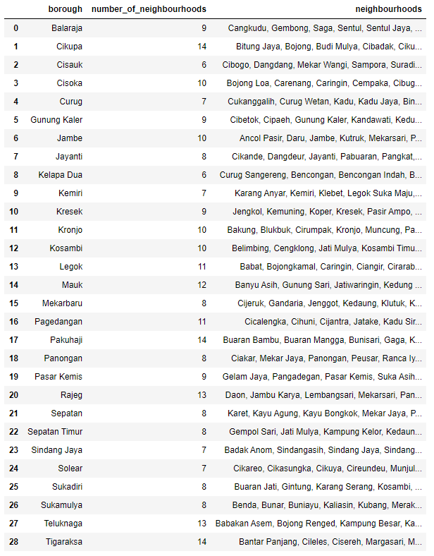

As we can see above, we don't have geocode information yet. Thus after downloading and extracting specific data from [Indonesian GeoJSON Dataset](https://github.com/ArrayAccess/Indonesia-Postal-And-Area/) After a little work, we get a csv file below for this project.

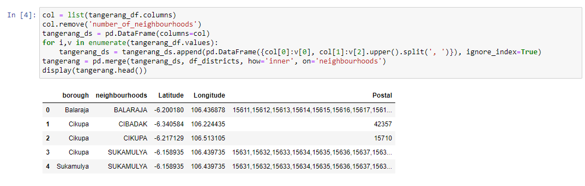

### **5.2 Exploratory data analysis**

First of all, let's plot the Borough & neighbourhood in Tangerang Regency Area.
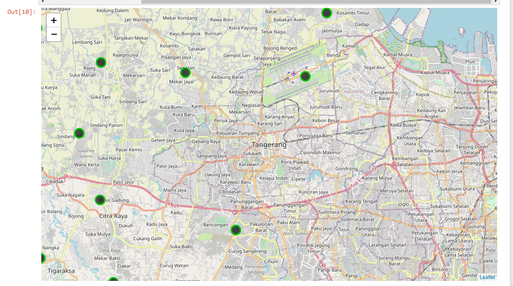
Note: please clone, fork, and navigate the map if you want to see whole Tangerang Regency

Fetch all the restaurant from Foursquare API.
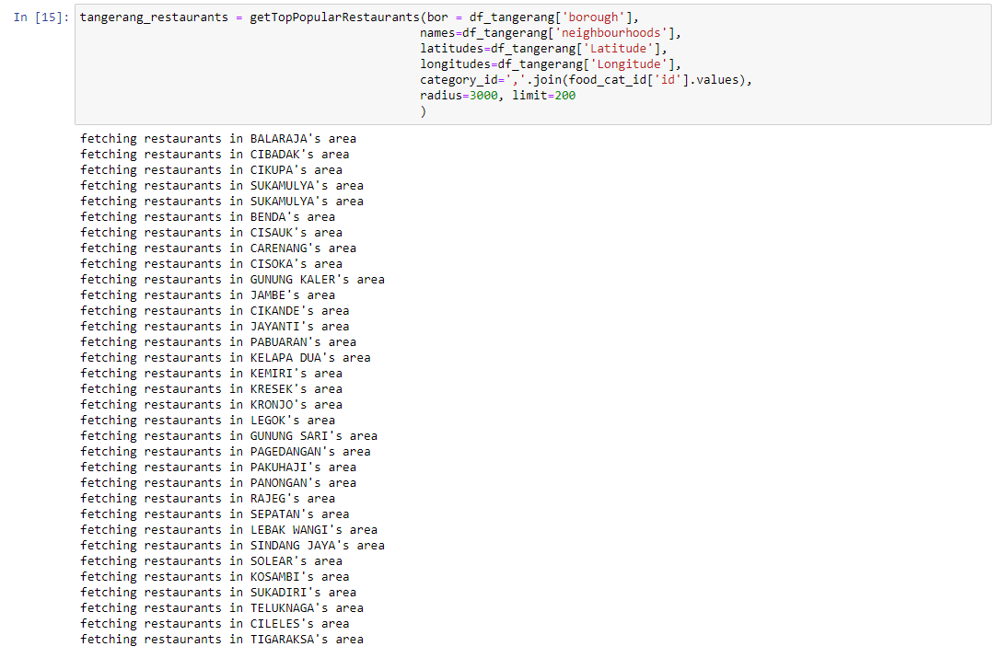

This is the dataframe and the grouping of each venue in respective neighbourhood
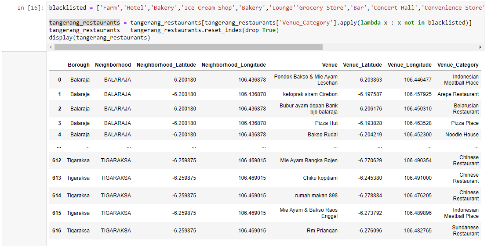
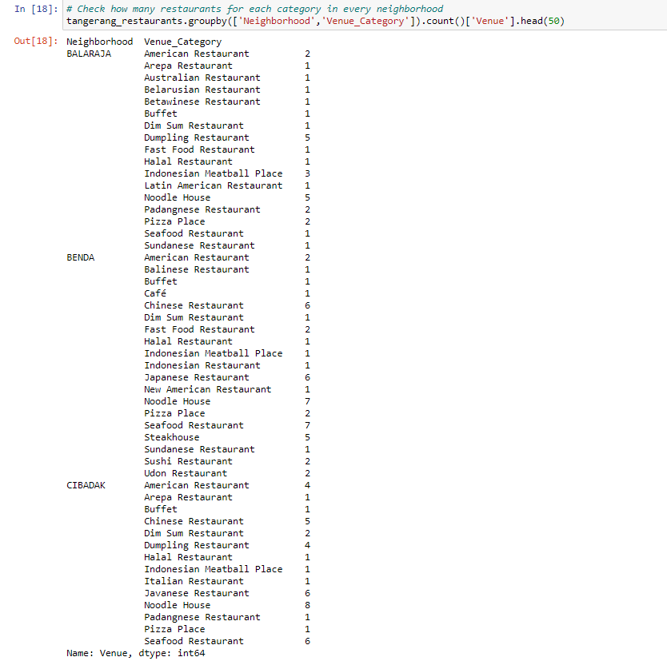

Visualize all the restaurant in each borough.
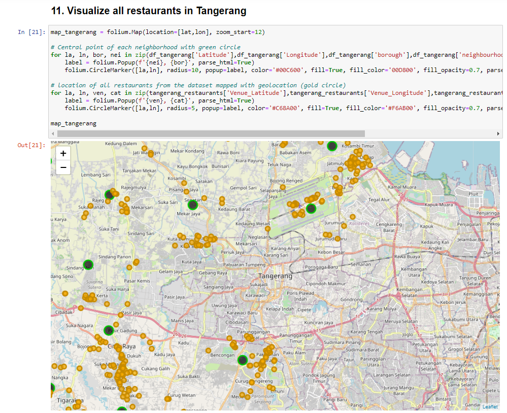
Note: please clone, fork, and navigate the map if you want to see whole Tangerang Regency

Get the 5 most 'existing/appearing' restaurant in foursquare database
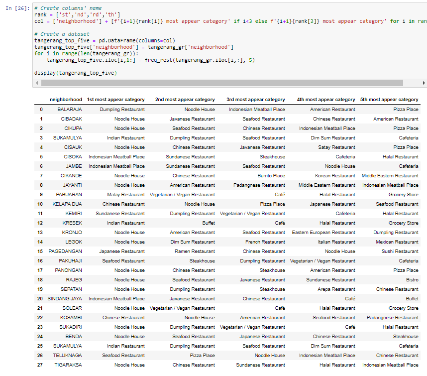

### **5.3 Clustering**
Do the K-mean clustering and try to find the elbow point
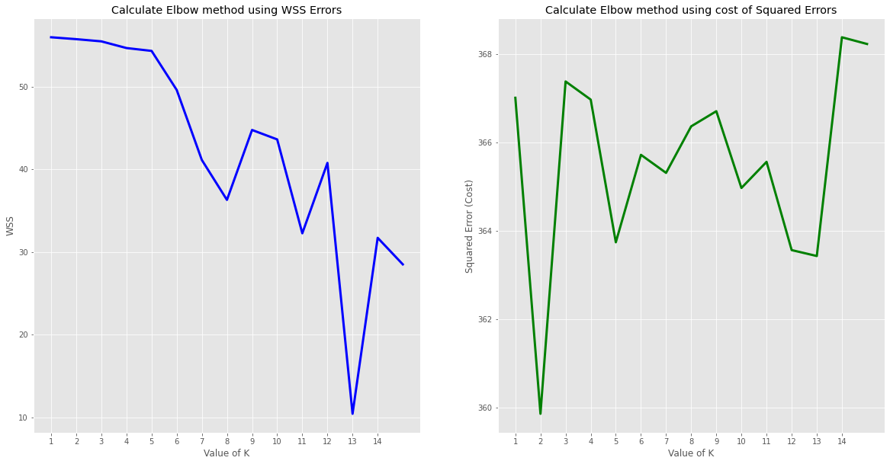
We could see at k=14 is the elbow point considering both WSS & Squared Error graphs.

Apply the clustering in the leaflet
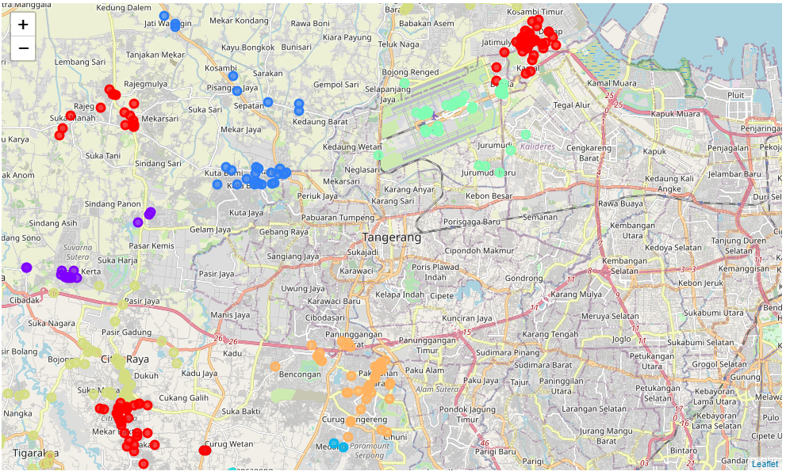
Note: please clone, fork, and navigate the map if you want to see whole Tangerang Regency

## **6. Results & Discussion**

After we cluster it, to find the easy to interpret recommendation for culinary business in each neighbourhood, let's used the [Weight Rating formula](https://trailerpark.weebly.com/uploads/8/8/5/5/8855465/7628808.png?371), considering number of population in each neighbourhood.
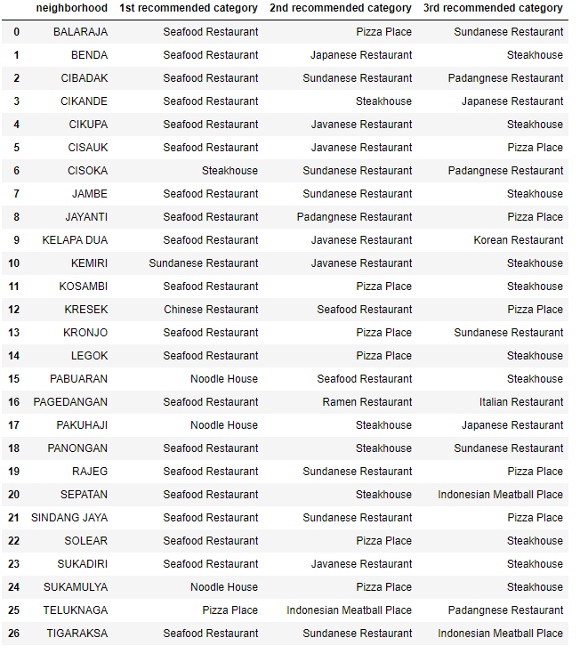

As you can see from the above table, majority of top 3 recommended categories are seafood, javanese, sundanese, and chinese food restaurant, considering Banten Province majorly consist of javanese, sundanese, and chinese population.

## **7. Conclusion**

In nowadays, data is valuable and able to give insightful insights and applicable to daily use case. However, the significancy of the information and interpretation depends on quality of data, method used to interpret, and how to interpret the results.
In this project, I used the knowledge learning from the IBM Data Science courses which suprisingly I fast-track it on 1 months, and exploring the current situation of the data industry, I have gained many skills and able to review some of the basic I miss when learning from another MOOC class. 

Hope you stay safe and healthy always

#### Tangerang, 06-01-2021 ####

## 7. References

[1]. https://github.com/devildances/RecommenderSystem_Project

[2]. https://github.com/fsiddh/IBM-Data-Science-Professional-Certification/tree/master/Applied%20Data%20Science%20Capstone